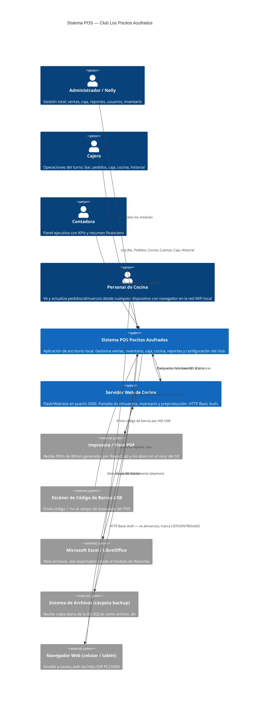

# 01 — Contexto del Sistema (C4 Level 1)

## Diagrama de Contexto

---

## Usuarios y Roles

| Rol | Usuario(s) | Acceso | Dashboard |
|-----|-----------|--------|-----------|
| `administrador` | admin, nelly | Todo | `dashboard.py` |
| `cajero` | cajero | Bar · Pedidos · Cocina · Cuentas · Caja · Historial | `dashboard_cajero.py` |
| `vendedor` | — | Igual que admin (por ahora) | `dashboard.py` |
| _(especial)_ | contadora | Panel ejecutivo propio | `dashboard_contadora.py` |

> **Nota**: El usuario `contadora` tiene un dashboard especial que se activa por **nombre**, no por rol.

---

## Límites del Sistema

### Dentro del sistema
- Autenticación local con bcrypt
- Base de datos SQLite (archivo único)
- Generación de PDFs de recibos
- Exportación a Excel
- Backup automático local
- Auditoría en BD

### Fuera del sistema (no implementado o futuro)
- Sincronización en la nube (`sync_url`, `sync_token` en configuración — preparado pero inactivo)
- Integración con pasarelas de pago electrónico
- Multi-sede / multi-terminal concurrente

### Implementado (anteriormente marcado como futuro)
- **Facturación electrónica DIAN** — flujo completo en `pos_module.py`: validación de resolución, solicitud de datos del cliente, generación de número `LP-XXXX`, inserción en `facturas_electronicas`. Ver `models/validaciones.py` y `models/series.py`.

---

## Stakeholders

| Parte interesada | Interés |
|-----------------|---------|
| Dueño del negocio | Ventas, gastos, utilidad, reportes |
| Administrador operativo | Inventario, usuarios, configuración |
| Cajero de turno | Rapidez en POS, cierre de caja sin errores |
| Personal de cocina | Ver pedidos pendientes sin usar teclado |
| Contador | Exportar datos a Excel para contabilidad |
