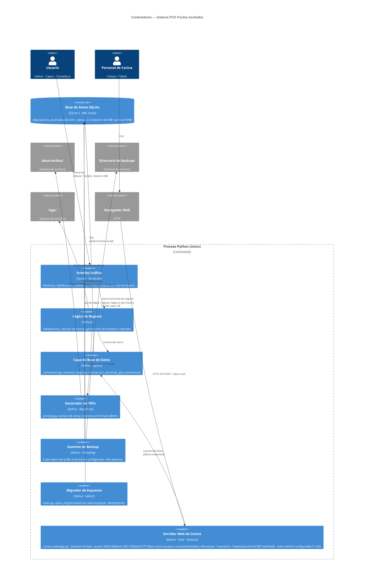

# 02 — Contenedores (C4 Level 2)

## Diagrama de Contenedores



---

## Descripción de Contenedores

### Interfaz Gráfica (`modules/`, `utils/tema_corporativo.py`)
- **Tecnología**: Tkinter nativo de Python — sin dependencias de sistema adicionales
- **Patrón**: Single-window con content_frame dinámico. El dashboard limpia el frame y carga el módulo activo.
- **Dashboards**: 3 (admin, cajero, contadora). Cada uno decide qué módulos expone en el sidebar.
- **Módulos**: 24 clases, cada una recibe `(parent: tk.Frame, usuario: dict)` y dibuja en ese frame.

### Capa de Base de Datos (`database/connection.py`)
- **3 funciones públicas**:
  - `get_connection()` — conexión simple sin context manager
  - `conexion_segura()` — context manager para lectura/escritura con `row_factory = sqlite3.Row`
  - `transaccion_atomica()` — context manager con `BEGIN IMMEDIATE`, commit o rollback automático
- **Configuración SQLite**: WAL · foreign_keys ON · busy_timeout 60s · cache 64MB

### Daemon de Backup (`main.py → iniciar_backup_automatico()`)
- Hilo `daemon=True` — se cancela automáticamente al cerrar la app
- Copia con `sqlite3.backup()` (sin bloquear la BD activa)
- Conserva los últimos 30 archivos
- Ruta configurable desde `configuracion.backup_ruta`

### Migrador de Esquema (`main.py → aplicar_migraciones()`)
- Se ejecuta en **cada arranque** antes de mostrar login
- Solo usa `ALTER TABLE ... ADD COLUMN IF NOT EXISTS` y `CREATE TABLE IF NOT EXISTS`
- **Nunca** elimina datos ni tablas existentes

---

## Estructura de Archivos en Disco

```
PocitosAzufrados-Desktop/
├── main.py                     ← Punto de entrada
├── setup.py                    ← Creación inicial de BD (ejecutar 1 vez)
├── requirements.txt
├── INICIAR.bat / INSTALAR.bat  ← Scripts Windows
│
├── data/
│   ├── pocitos_azufrados.db    ← Base de datos principal
│   ├── backups/                ← Copias diarias (nombre: pocitos_YYYYMMDD_HHMMSS.db)
│   └── recibos/                ← PDFs generados (nombre: recibo_POS-XXXX.pdf)
│
├── logs/
│   └── app.log                 ← Log rotativo (5 MB × 3 archivos)
│
├── database/
│   └── connection.py
├── models/
│   └── series.py               ← Generadores thread-safe POS-XXXX, BOL-XXXX
├── utils/
│   ├── tema_corporativo.py     ← Paleta · Fuentes · Helpers UI
│   ├── logger.py               ← RotatingFileHandler + log_auditoria()
│   └── printing.py             ← Generación PDFs ReportLab
└── modules/
    └── *.py                    ← 24 módulos funcionales
```
