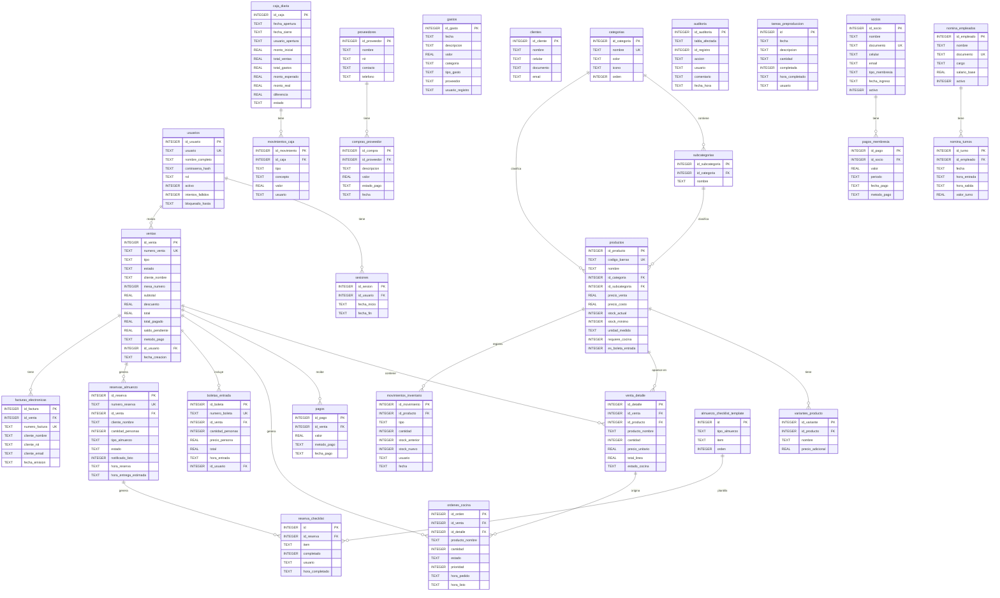

# 04 — Modelo de Datos

## Grupos de Tablas

```
┌─ IDENTIDAD ───────────────────┐  ┌─ VENTAS ──────────────────────────┐
│  usuarios                     │  │  ventas                            │
│  sesiones                     │  │  venta_detalle                     │
│  auditoria                    │  │  pagos                             │
└───────────────────────────────┘  │  ordenes_cocina                    │
                                   │  boletas_entrada                   │
┌─ CATÁLOGO ────────────────────┐  │  devoluciones                      │
│  categorias                   │  │  facturas_electronicas             │
│  subcategorias                │  └────────────────────────────────────┘
│  productos                    │
│  variantes_producto           │  ┌─ ALMUERZOS / COCINA WEB ───────────┐
└───────────────────────────────┘  │  reservas_almuerzo                 │
                                   │  ordenes_cocina                    │
┌─ CONTACTOS ───────────────────┐  │  almuerzo_checklist_template       │
│  clientes                     │  │  reserva_checklist                 │
│  proveedores                  │  │  tareas_preproduccion              │
│  compras_proveedor            │  └────────────────────────────────────┘
└───────────────────────────────┘
                                   ┌─ CAJA & GASTOS ────────────────────┐
┌─ SOCIOS ──────────────────────┐  │  caja_diaria                       │
│  socios                       │  │  movimientos_caja                  │
│  pagos_membresia              │  │  gastos                            │
└───────────────────────────────┘  └────────────────────────────────────┘

┌─ NÓMINA ──────────────────────┐  ┌─ INVENTARIO ───────────────────────┐
│  nomina_empleados             │  │  movimientos_inventario             │
│  nomina_turnos                │  └────────────────────────────────────┘
└───────────────────────────────┘
                                   ┌─ SYNC ─────────────────────────────┐
┌─ SERIES & CONFIG ─────────────┐  │  sync_queue                         │
│  series_facturacion           │  └────────────────────────────────────┘
│  series_boletas               │
│  metodos_pago                 │
│  configuracion                │
└───────────────────────────────┘
```

---

## Diagrama ER Principal



---

## Tablas de Configuración y Series

### `configuracion` (clave/valor)

| Clave | Valor por defecto | Descripción |
|-------|-------------------|-------------|
| `nombre_negocio` | Club Los Pocitos Azufrados | Aparece en recibos PDF |
| `ubicacion` | Tocaima, Cundinamarca | Aparece en recibos PDF |
| `nit` | _(vacío)_ | Número de identificación tributaria |
| `precio_boleta_persona` | 35000 | COP — leído por `boletas_module.py` |
| `metodos_pago_habilitados` | EFECTIVO,NEQUI,DAVIPLATA,… | CSV — leído por POS y gastos |
| `backup_ruta` | _(vacío)_ | Ruta del directorio de backups |
| `backup_intervalo_horas` | 24 | Intervalo del daemon de backup |
| `categorias_gastos` | Compras Insumos,… | CSV — leído por gastos_module |

### `series_facturacion` y `series_boletas`

```
Formato: {prefijo}-{año}-{consecutivo:06d}
Ejemplo ventas: POS-2026-000001
Ejemplo boletas: BOL-2026-000001

El año se resetea automáticamente cuando cambia el año calendario.
Thread-safe via threading.Lock en models/series.py.
```

---

## Índices de Rendimiento (22 total)

```sql
-- Búsqueda de productos (POS con escáner)
idx_productos_codigo    ON productos(codigo_barras)
idx_productos_nombre    ON productos(nombre)
idx_productos_categoria ON productos(id_categoria)
idx_productos_activo    ON productos(activo)

-- Consultas de ventas
idx_ventas_estado       ON ventas(estado)
idx_ventas_fecha        ON ventas(fecha_creacion)
idx_ventas_numero       ON ventas(numero_venta)
idx_venta_detalle_venta ON venta_detalle(id_venta)

-- Cocina (auto-refresh)
idx_ordenes_cocina_estado ON ordenes_cocina(estado)
idx_ordenes_cocina_venta  ON ordenes_cocina(id_venta)

-- Reportes financieros
idx_boletas_fecha       ON boletas_entrada(hora_entrada)
idx_gastos_fecha        ON gastos(fecha)
idx_gastos_categoria    ON gastos(categoria)
idx_caja_estado         ON caja_diaria(estado)
idx_pagos_venta         ON pagos(id_venta)
idx_movimientos_inv     ON movimientos_inventario(id_producto)

-- Auditoría y sync
idx_auditoria_tabla     ON auditoria(tabla_afectada)
idx_sync_estado         ON sync_queue(estado)
```

---

## Restricciones de Dominio (CHECK)

```sql
usuarios.rol           IN ('administrador','cajero','vendedor')
productos.unidad_medida IN ('unidad','litro','kilo','porcion','boleta')
ventas.tipo            IN ('normal','cuenta_abierta','boleta','para_llevar')
ventas.estado          IN ('ABIERTA','CERRADA','PAGADA','ANULADA')
venta_detalle.estado_cocina IN ('N/A','PENDIENTE','PREPARANDO','LISTO','ENTREGADO')
ordenes_cocina.estado  IN ('PENDIENTE','PREPARANDO','LISTO','ENTREGADO','CANCELADO')
gastos.tipo_gasto      IN ('OPERATIVO','COMPRA_INVENTARIO','SERVICIOS','NOMINA','OTRO')
caja_diaria.estado     IN ('ABIERTA','CERRADA')
movimientos_inventario.tipo IN ('ENTRADA','SALIDA','AJUSTE','VENTA','DEVOLUCION')
compras_proveedor.estado_pago IN ('PENDIENTE','PAGADA')
movimientos_caja.tipo  IN ('INGRESO','EGRESO')
sync_queue.accion      IN ('INSERT','UPDATE','DELETE')
sync_queue.estado      IN ('PENDIENTE','ENVIANDO','COMPLETADO','ERROR')
```
