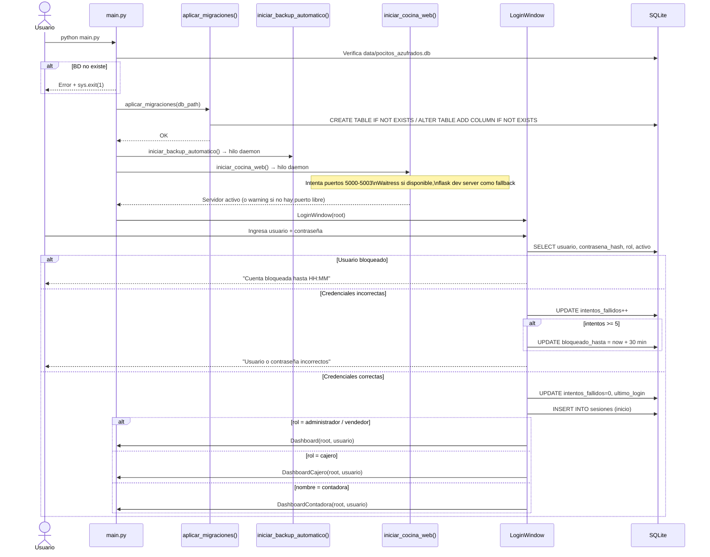
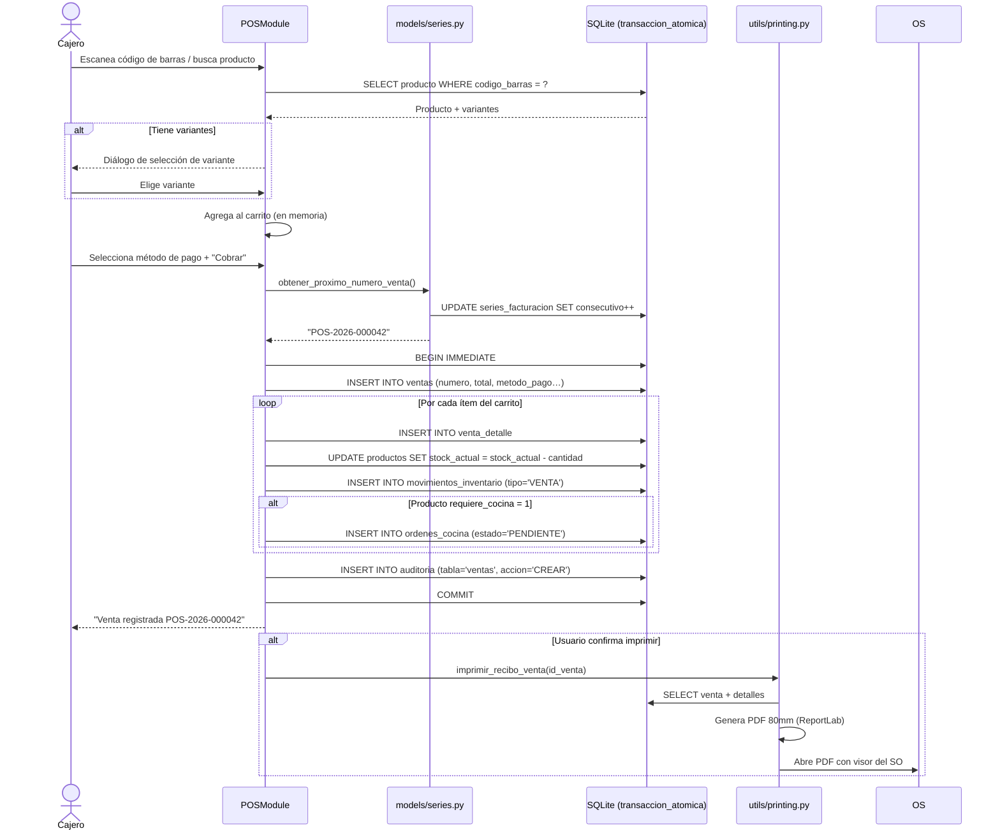
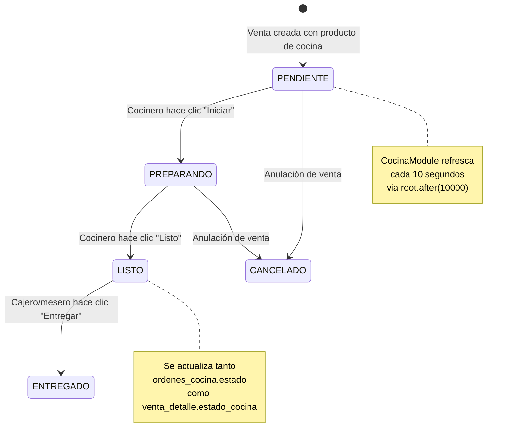
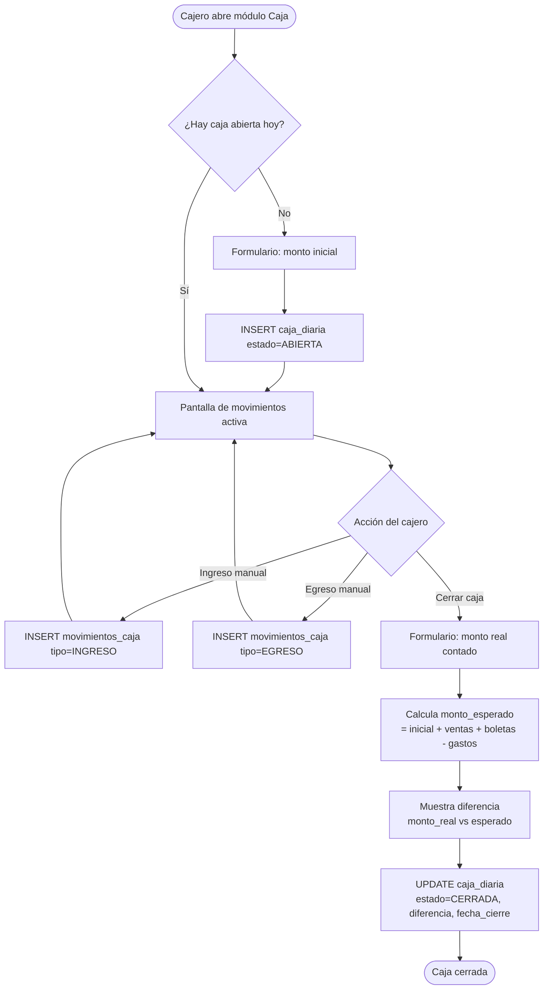
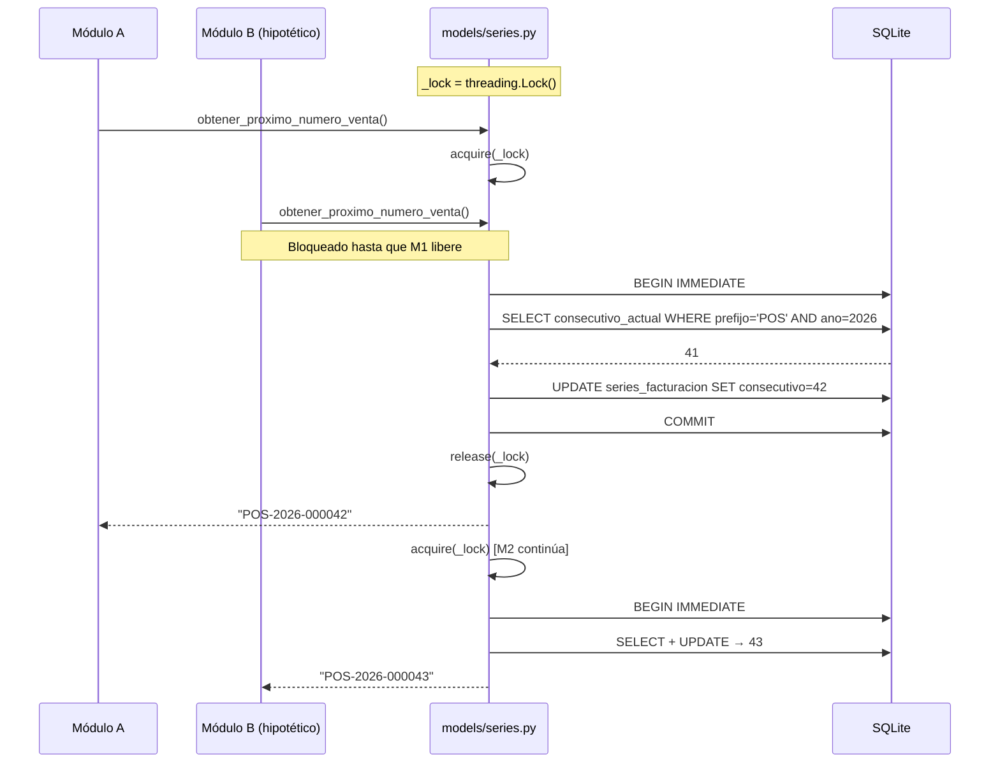
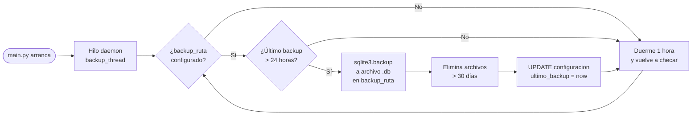
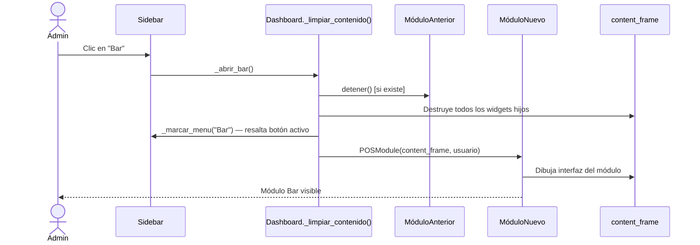
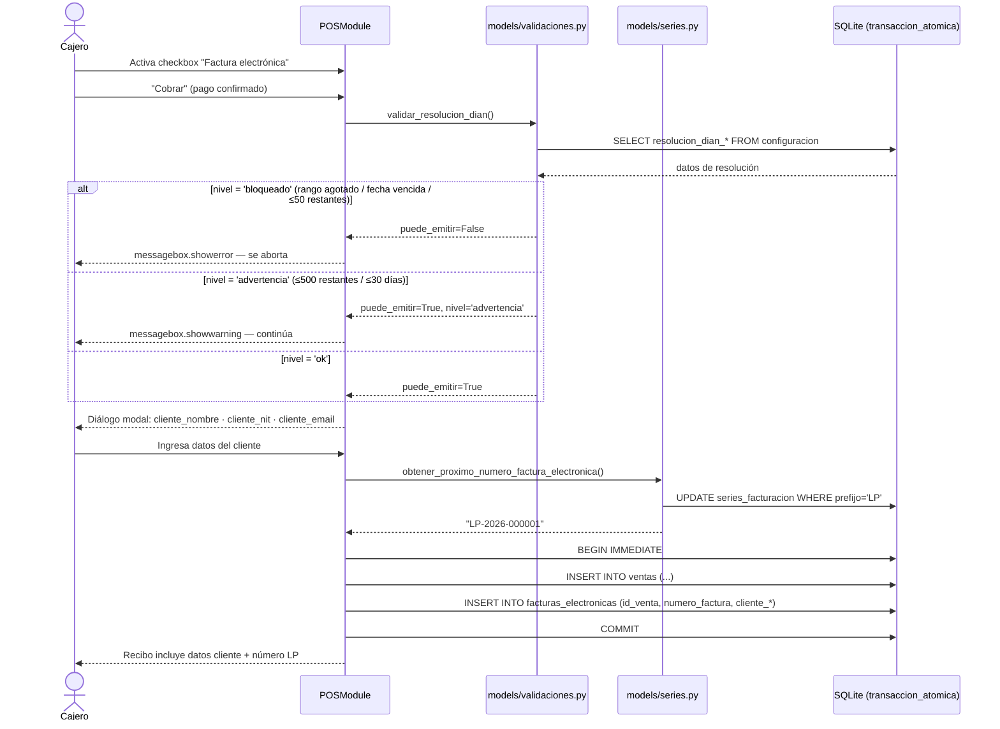
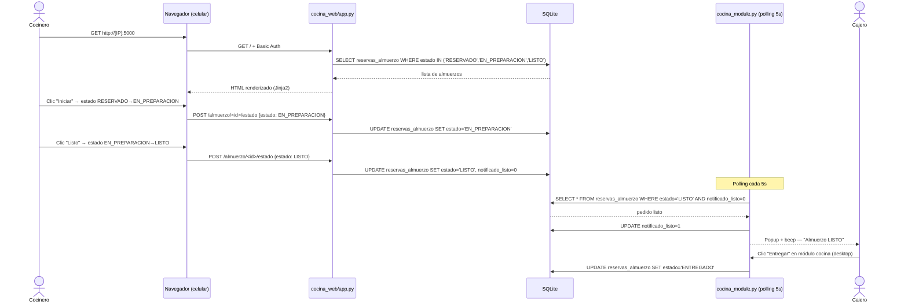

# 05 — Flujos Clave del Sistema

## 1. Arranque y Autenticación

---

## 2. Venta en el Bar (POS)

---

## 3. Flujo de Cocina

---

## 4. Apertura y Cierre de Caja

---

## 5. Generación de Número Consecutivo (Thread-Safe)

---

## 6. Backup Automático (Daemon)

---

## 7. Navegación entre Módulos (Dashboard)

---

## 8. Factura Electrónica DIAN

---

## 9. Cocina Web — Ciclo de Estado de Almuerzo

