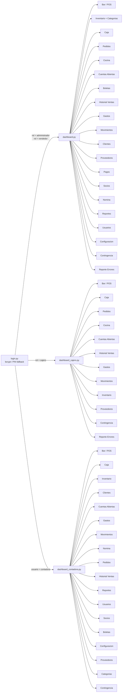
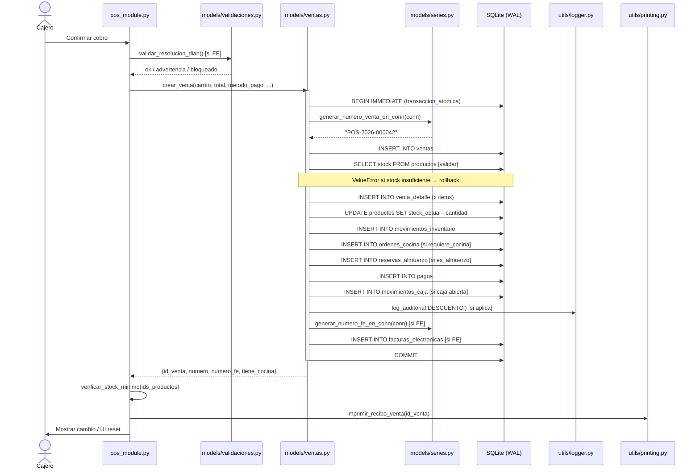
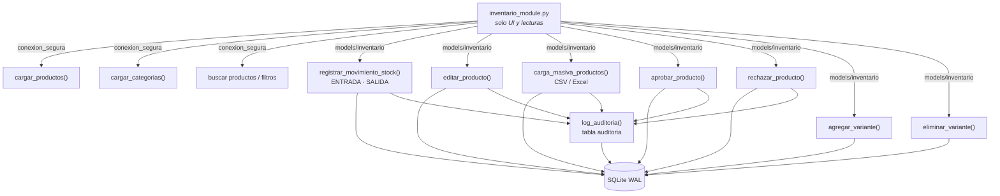
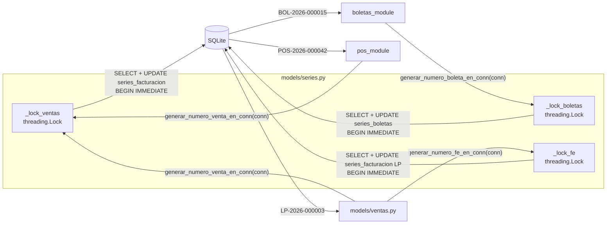

# Arquitectura — Club Los Pocitos Azufrados POS
_Última actualización: 2026-05-17_

---

## 0. Diagrama de capas

```
main.py (orquestador)
  │
  ├── utils/          (tema, logger, printing)              ← sin dependencias locales
  ├── database/       (connection.py)                       ← sin dependencias locales
  ├── models/         (ventas, inventario, series, validaciones) ← depende de database/, utils/
  ├── modules/        (25 módulos UI)                       ← depende de todo lo anterior
  └── cocina_web/     (Flask server)                        ← depende solo de database/
```

El flujo de dependencias es **estrictamente unidireccional**:
`main → modules → models → database/utils`

Ninguna capa importa a la capa superior. `utils/` y `database/` no importan nada local.

---

## 1. Capas del sistema (Mermaid)

```mermaid
graph TB
    subgraph ENTRY["Punto de entrada"]
        main["main.py<br/>migraciones · backup daemon · cocina daemon · login"]
    end

    subgraph UI["UI Layer — modules/"]
        direction TB
        DA["dashboard.py<br/><i>administrador / vendedor</i>"]
        DC["dashboard_cajero.py<br/><i>cajero</i>"]
        DK["dashboard_contadora.py<br/><i>contadora</i>"]
        LG["login.py"]
    end

    subgraph MODS["Módulos funcionales — modules/"]
        direction LR
        POS["pos_module<br/>Bar / POS"]
        INV["inventario_module<br/>+ categorias_module"]
        CAJ["caja_module"]
        CUE["cuentas_abiertas_module"]
        COC["cocina_module"]
        HIS["historial_ventas_module"]
        BOL["boletas_module"]
        REP["reportes_module"]
        NOM["nomina_module"]
        SOC["socios_module"]
        CLI["clientes_module"]
        PRO["proveedores_module"]
        GAS["gastos_module"]
        MOV["movimientos_module"]
        PED["pedidos_module"]
        PAG["pagos_module"]
        USU["usuarios_module"]
        CFG["config_module"]
        CON["contingencia_module"]
        ERR["reporte_errores_module"]
    end

    subgraph BL["Business Logic — models/"]
        MV["ventas.py<br/>crear_venta · abrir_cuenta_abierta<br/>verificar_stock_minimo"]
        MI["inventario.py<br/>registrar_movimiento_stock<br/>editar_producto · carga_masiva<br/>aprobar / rechazar · variantes"]
        MS["series.py<br/>POS / BOL / LP numbers<br/>thread-safe + SQLite lock"]
        MVal["validaciones.py<br/>validar_resolucion_dian<br/>verificar_pin_admin"]
    end

    subgraph UTILS["Utilidades — utils/"]
        TC["tema_corporativo.py<br/>colores · fuentes · widgets"]
        LGR["logger.py<br/>log_auditoria · log_performance"]
        PR["printing.py<br/>PDF 80mm/58mm · ESC/POS"]
    end

    subgraph DB["Data Layer"]
        CONN["database/connection.py<br/>conexion_segura · transaccion_atomica"]
        SQLITE[("SQLite WAL<br/>pocitos_azufrados.db")]
    end

    subgraph WEB["Web — cocina_web/"]
        FLASK["app.py Flask :5000<br/>Waitress (prod) · Basic Auth"]
        HTML["templates/cocina.html"]
        CSS["static/cocina.css"]
    end

    main --> LG
    LG --> DA & DC & DK
    DA & DC & DK --> MODS
    POS --> MV & MS & MVal
    INV --> MI
    BOL --> MS
    CON --> MV & MS
    MODS --> CONN
    BL --> CONN & LGR
    CONN --> SQLITE
    FLASK --> CONN
    FLASK --> HTML & CSS
    POS & BOL & HIS --> PR
    MODS --> TC
```



---

## 2. Acceso por rol (Dashboard → Módulos)



---

## 3. Flujo de una venta POS



---

## 4. Operaciones de inventario



---

## 5. Generacion de numeros consecutivos



---

## 6. Fortalezas

1. **Separación clara de capas** — `utils/` no importa `modules/`, `models/` no importa `modules/`. Flujo unidireccional garantizado.
2. **Context managers para BD** — `conexion_segura()` y `transaccion_atomica()` eliminan fugas de conexión y garantizan rollback automático.
3. **Números consecutivos thread-safe** — `models/series.py` usa `threading.Lock()` + `BEGIN IMMEDIATE`. Probado con 50 hilos concurrentes sin duplicados.
4. **Lazy imports en dashboards** — cada `_abrir_*` importa su módulo dentro de un `try`, evitando que un módulo roto tumbe todo el dashboard.
5. **Patrón `detener()` obligatorio** — resuelve el problema clásico de Tkinter con `after()` zombie en módulos destruidos.
6. **Auditoría en misma transacción** — `log_auditoria(conn, ...)` recibe la conexión abierta; si la operación falla, el registro de auditoría también se revierte.
7. **Test coverage sólido** — 70 tests, incluyendo simulación de día completo, validaciones DIAN, PIN admin y lógica de ventas con 27 casos.

---

## 7. Métricas actuales

| Métrica | Valor |
|---------|-------|
| Líneas de código (Python) | ~18.000 |
| Módulos UI | 25 |
| Tablas BD | 30+ |
| Tests automatizados | 70 |
| Cobertura lógica de negocio (`models/`) | Buena — ventas, inventario, validaciones, series |
| Cobertura de UI | Nula |
| Cobertura de integración (día completo) | Excelente — 2 suites distintas |
